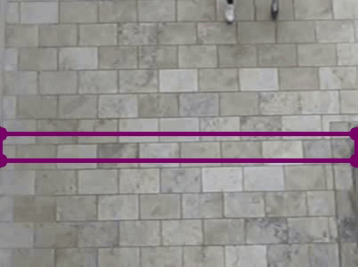

# People-Counting-In-Out

This project implements a **People Counting System** that tracks and counts individuals entering and exiting a predefined region in a video. It uses **Ultralytics' Object Counter solution** with a YOLO model (`yolo11n.pt`). The system is ideal for applications in malls, offices, hospitals, and other facilities where monitoring foot traffic is essential.

## Key Features

- **Real-Time People Counting**: Tracks and counts people crossing a designated region in the video, providing separate counts for "In" and "Out" movements.
- **Region-Based Tracking**: Supports rectangular regions for monitoring specific areas.
- **Annotated Video Output**: Saves the output video with annotated bounding boxes, region markers, and counts.
- **Performance**: Processes each frame in approximately **~200ms**, including:
  - Reading the video frame
  - Object detection
  - Tracking and counting objects crossing the region
  - Annotating the frame and writing to the output video

## Applications

- **Malls**: Monitor customer foot traffic for better management and analysis.
- **Offices**: Track employee or visitor flow for security and resource allocation.
- **Hospitals**: Count individuals entering and exiting specific zones for efficient crowd management.

## System Performance

- **Average Processing Time**: ~200ms per frame (includes frame reading, detection, tracking, counting, annotation, and writing output).
- **System Specs**:
  - Processor: Intel Core i5-6300U @ 2.40GHz
  - RAM: 8GB
  - **No GPU** was used for this project.

## Example Output

Here is a snapshot from the annotated output video:



The annotated video shows the bounding boxes, counts, and the designated region for tracking.

## Prerequisites

- Python 3.x
- Video file (`demo.mp4`) for processing.
- Custom YOLO model file (`yolo11n.pt`).

## Setup

1. Clone the repository:
   ```bash
   git clone https://github.com/your-username/people-counting.git
   cd people-counting
   ```
2. Install the required dependencies:
```bash
  pip install -r requirements.txt
```
3. Add the input video file (demo.mp4) to the repository.
4. Ensure the custom YOLO model file (yolo11n.pt) is in the correct location.

## Running the Code

To process the video and generate the output:
```bash
  python run.py
```
### Output
- Annotated Video: The processed video will be saved as demo_out.avi.
- Processing Time: Average processing time per frame is printed in the terminal after execution.

## Future Enhancements
- Real-Time Processing: Integrate with live camera feeds for real-time counting.
- Improved Performance: Optimize processing time for faster frame rates.
- Multi-Region Tracking: Extend support for monitoring multiple regions simultaneously.
- Data Analytics: Log and analyze traffic data for insights and predictions.

## Acknowledgments
This project uses:
- Ultralytics Solutions for object detection and tracking.
- OpenCV for video processing

## Contact
For questions or contributions, feel free to contact me or open an issue in the repository.
